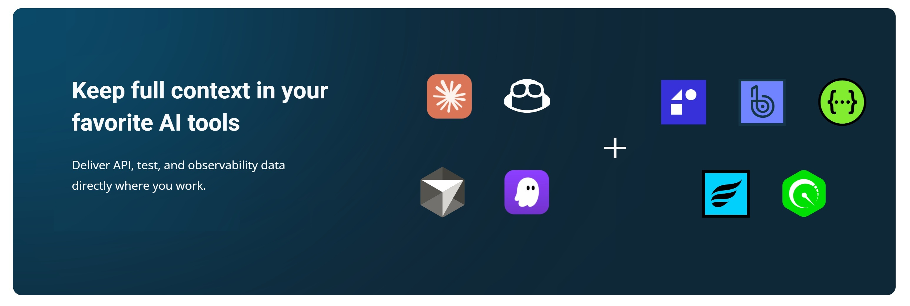

The SmartBear MCP Server provides access to multiple capabilities across our Swagger, Reflect, QMetry, QTM4J, Zephyr, and BugSnag, all through dedicated tools and resources.

### Available Tools, Resources, and Prompts

-   [Swagger Portal](/smartbear-mcp/docs/swagger-portal-integration) - provides portal and product management capabilities
-   [Swagger Studio](/smartbear-mcp/docs/swagger-studio-integration) - provides API and Domain management capabilities
-   [Swagger Contract Testing (PactFlow)](/smartbear-mcp/docs/contract-testing-with-pactflow) - provides contract testing capabilities
-   [Reflect](/smartbear-mcp/docs/reflect-integration) - provides test management and execution capabilities
-   [BugSnag](/smartbear-mcp/docs/bugsnag-integration) - provides error monitoring and debugging capabilities
-   [QMetry](/smartbear-mcp/docs/qmetry-integration) - provides QMetry Test Management capabilities
-   [Zephyr](/smartbear-mcp/docs/zephyr-integration) - Zephyr Test Management capabilities
-   [Collaborator](/smartbear-mcp/docs/collaborator-integration) - provides Review and Remote System Configuration management capabilities
-   [QTM4J](/smartbear-mcp/docs/qtm4j-integration) - QTM4J Test Management capabilities
