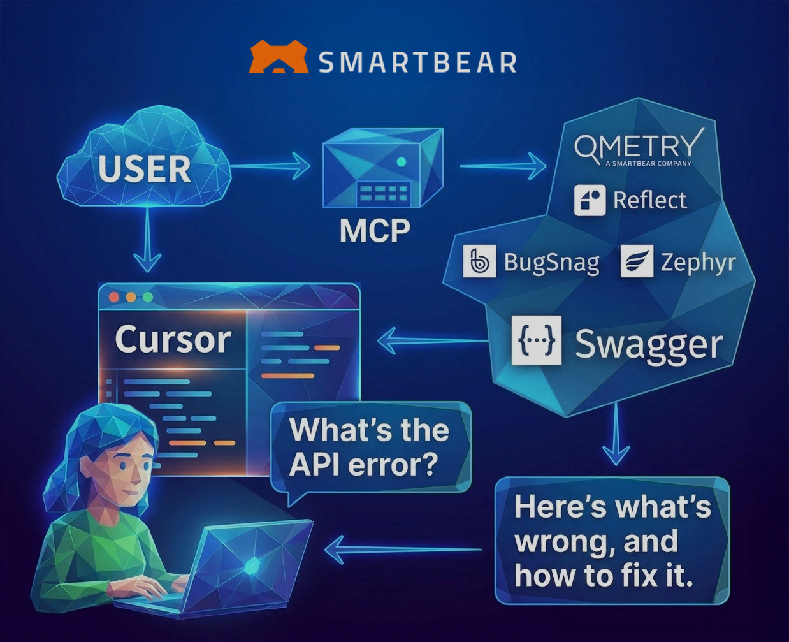

The SmartBear MCP Server is a secure bridge between SmartBear platform data and AI-powered development workflows. Built on the [Model Context Protocol (MCP)](https://modelcontextprotocol.io/introduction), it surfaces rich context from across SmartBear products directly inside your AI assistant or IDE.

> ℹ️ The SmartBear MCP Server is under active development. New features ship regularly — check our [GitHub repository](https://github.com/SmartBear/smartbear-mcp) for the latest updates and compatibility information.

Bring SmartBear context into tools like GitHub Copilot, Cursor, Claude, and other MCP-compatible clients:

- **API design & governance** — Swagger definitions, style rules, portal docs
- **Testing** — Reflect runs, QMetry and Zephyr test outcomes
- **Contract testing** — PactFlow interactions and verification results
- **Error & performance monitoring** — BugSnag error reports and diagnostics
- **Code review** — Collaborator review context

## What is the Model Context Protocol?

The Model Context Protocol (MCP) is an open standard that enables secure, structured communication between AI applications and external data sources. It allows Large Language Models (LLMs) to access real-time data and perform actions while maintaining security and context boundaries.

Key benefits of MCP include:

- **Secure data access** — controlled, authenticated access to sensitive data
- **Real-time context** — fresh data from your applications and services
- **Standardized interface** — works across multiple AI clients and platforms
- **Tool integration** — enables AI to perform actions, not just read data

## Deployment modes

The MCP Server is available in two deployment modes. Pick the one that fits your workflow — see [Getting Started](./getting-started) for a full comparison.

| | [Remote MCP Servers](/smartbear-mcp/docs/remote-mcp-servers) | [Local MCP Server](/smartbear-mcp/docs/local-server) |
|---|---|---|
| **Products** | Swagger, BugSnag, Zephyr | All products (incl. Reflect, QMetry, PactFlow, Collaborator) |
| **Setup** | None — add a URL to your MCP client | Install via npm (Node.js 20+) |
| **Authentication** | OAuth browser flow | API tokens via environment variables |
| **Configuration** | Headers and query string | Environment variables |
| **Best for** | Quick setup for a single product | Multi-product workflows |

## Example: debugging with BugSnag and Copilot

Here's how the MCP Server fits into a real workflow — solving a software bug using the BugSnag tools combined with GitHub Copilot:

See the [full capabilities matrix](/smartbear-mcp/docs/mcp-server-capabilities) for what each integration exposes.

## Next steps

- [Getting Started](./getting-started) — choose remote vs. local
- [Set up a Remote MCP Server](./remote-mcp-servers) — zero-install, OAuth
- [Set up the Local MCP Server](./local-server) — npm-based, all products
