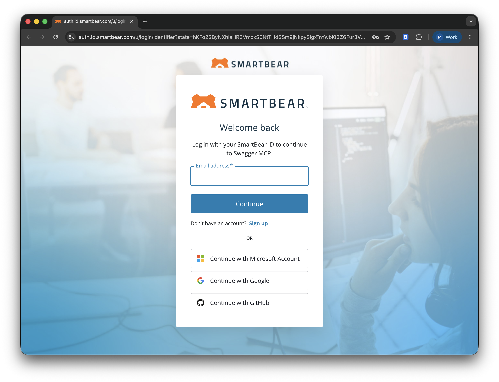

The Swagger Remote MCP Server gives your AI assistant access to Swagger Portal and Swagger Studio tools — no installation required.

**Server URL:** `https://swagger.mcp.smartbear.com/mcp`

For the full list of available tools, see [Swagger Portal Integration](/smartbear-mcp/docs/swagger-portal-integration) and [Swagger Studio Integration](/smartbear-mcp/docs/swagger-studio-integration).

## Authentication

Connect your MCP client using the URL above. On first connection, your client will open a browser window to complete a SmartBear OAuth login. No API tokens or environment variables are required.



## MCP Client Configuration

### VS Code with GitHub Copilot

Create or edit `.vscode/mcp.json` in your workspace:

```json
{
  "servers": {
    "smartbear-swagger": {
      "type": "http",
      "url": "https://swagger.mcp.smartbear.com/mcp"
    }
  }
}
```

### Cursor

Add to your `mcp.json` configuration:

```json
{
  "mcpServers": {
    "smartbear-swagger": {
      "transport": {
        "type": "http",
        "url": "https://swagger.mcp.smartbear.com/mcp"
      }
    }
  }
}
```

### Claude Desktop

Edit your `claude_desktop_config.json` file:

```json
{
  "mcpServers": {
    "smartbear-swagger": {
      "transport": {
        "type": "http",
        "url": "https://swagger.mcp.smartbear.com/mcp"
      }
    }
  }
}
```

### Claude Code

```
claude mcp add --transport http smartbear-swagger https://swagger.mcp.smartbear.com/mcp
```
