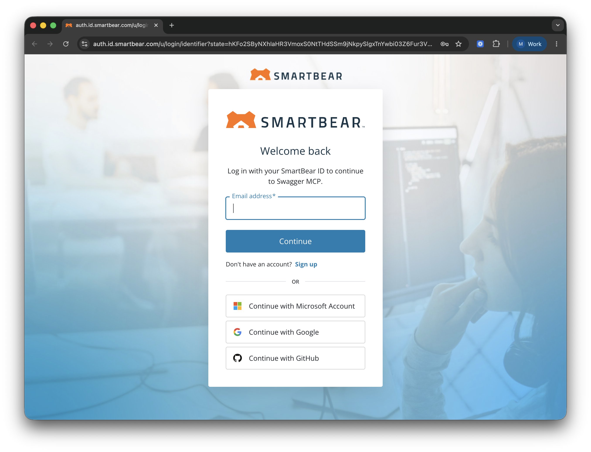

The Swagger Remote MCP Server gives your AI assistant access to Swagger Portal and Swagger Studio tools — no installation required.

**Server URL:** `https://swagger.mcp.smartbear.com/mcp`

For the full list of available tools, see [Swagger Portal Integration](/smartbear-mcp/docs/swagger-portal-integration) and [Swagger Studio Integration](/smartbear-mcp/docs/swagger-studio-integration).

## Authentication

Connect your MCP client using the URL above. On first connection, your client will open a browser window to complete a SmartBear OAuth login. No API tokens or environment variables are required.



## MCP Client Configuration

### VS Code with GitHub Copilot

[Install in VS Code →](https://vscode.dev/redirect/mcp/install?name=swagger&config=%7B%22type%22%3A%22http%22%2C%22url%22%3A%22https%3A%2F%2Fswagger.mcp.smartbear.com%2Fmcp%22%7D)

Or add manually — create or edit `.vscode/mcp.json` in your workspace:

```json
{
  "servers": {
    "smartbear-swagger": {
      "type": "http",
      "url": "https://swagger.mcp.smartbear.com/mcp"
    }
  }
}
```

### Cursor

[](https://cursor.com/install-mcp?name=swagger&config=eyJ1cmwiOiJodHRwczovL3N3YWdnZXIubWNwLnNtYXJ0YmVhci5-jb20vbWNwIn0%3D)

Or add manually to your `mcp.json` configuration:

```json
{
  "mcpServers": {
    "swagger-mcp": {
      "transport": {
        "type": "http",
        "url": "https://swagger.mcp.smartbear.com/mcp"
      }
    }
  }
}
```

### Claude Desktop

[Add to Claude →](https://claude.ai/customize/connectors/id/ant.dir.gh.smartbear.smartbear-mcp?modal=add-custom-connector&connectorName=Swagger&connectorUrl=https%3A%2F%2Fswagger.mcp.smartbear.com%2Fmcp&q=smartbear)

Or add manually to your `claude_desktop_config.json`:

```json
{
  "mcpServers": {
    "smartbear-swagger": {
      "transport": {
        "type": "http",
        "url": "https://swagger.mcp.smartbear.com/mcp"
      }
    }
  }
}
```

### Claude Code

```
claude mcp add --transport http smartbear-swagger https://swagger.mcp.smartbear.com/mcp
```

### Kiro (AWS)

[](https://kiro.dev/launch/mcp/add?name=swagger&config=%7B%22type%22%3A%22http%22%2C%22url%22%3A%22https%3A%2F%2Fswagger.mcp.smartbear.com%2Fmcp%22%2C%22oauth%22%3A%7B%22oauthScopes%22%3A%5B%5D%7D%2C%22disabled%22%3Afalse%2C%22autoApprove%22%3A%5B%5D%7D)

Or add manually to your `~/.kiro/settings/mcp.json`:

```json
{
  "mcpServers": {
    "swagger": {
      "type": "http",
      "url": "https://swagger.mcp.smartbear.com/mcp",
      "oauth": {
        "oauthScopes": []
      },
      "disabled": false,
      "autoApprove": []
    }
  }
}
```
